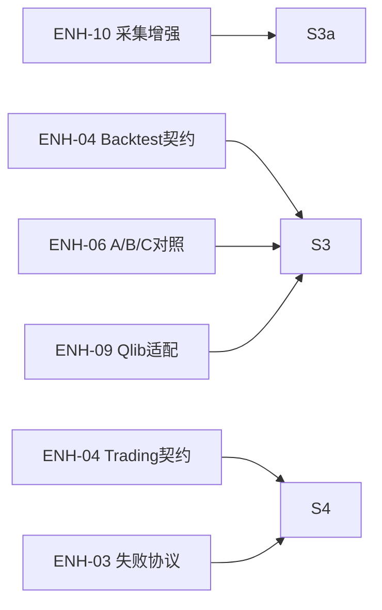

# EmotionQuant S3a-S4b 真螺旋执行路线图（执行版 v1.0）

**状态**: Active  
**更新时间**: 2026-02-19  
**适用范围**: S3a-S4b（阶段B：数据采集增强、回测、纸上交易、收益归因、极端防御）  
**文档角色**: S3a-S4b 执行合同（不是上位 SoT 替代）

---

## 0. 文档定位（先对齐 SoT）

冲突处理优先级（从高到低）：

1. `docs/design/enhancements/eq-improvement-plan-core-frozen.md`（唯一执行基线）
2. `Governance/Capability/SPIRAL-CP-OVERVIEW.md`（路线主控）
3. `Governance/steering/6A-WORKFLOW.md` + `Governance/steering/系统铁律.md`
4. `Governance/SpiralRoadmap/SPIRAL-STAGE-TEMPLATES.md`（阶段A/B/C 门禁模板）
5. 本文件（S3a-S4b 微圈执行合同）

本文件只负责两件事：

- 把 S3a-S4b 拆成可收口微圈
- 给每圈定义可审计的 `run/test/artifact/review/sync` 合同

---

## 1. 现实基线快照（As-Is, 2026-02-19）

1. S2c、S3a、S4 已按 6A 收口完成，S3 处于 `in_progress`，并已打通 S3a->S3 与 S4->S3b 的消费门禁链路（见 `Governance/record/development-status.md`）。
2. `eq` 统一入口已完成阶段B关键命令接入：`fetch-batch/fetch-status/fetch-retry/backtest/trade/analysis`；`stress` 仍待后续圈补齐。
3. `src/backtest` 已扩展多交易日回放与 T+1/涨跌停最小执行细节，`src/trading` 已落地 S4 paper trade 最小链路，`src/analysis` 已落地 S3b 最小执行入口。
4. 已存在且可复用的门禁测试主路径：`tests/unit/config/*`、`tests/unit/integration/*`、`tests/unit/scripts/test_local_quality_check.py`、`tests/unit/scripts/test_contract_behavior_regression.py`、`tests/unit/scripts/test_governance_consistency_check.py`。
5. 阶段B执行卡已补齐并挂接：`S3A/S3/S3R/S4/S3AR/S4R/S3B/S4B/S4BR-EXECUTION-CARD.md`。
6. 现实新增阻断：采集阶段出现过 DuckDB 文件锁导致批次失败；当前已落地双 TuShare 主备（10000 网关主 + 5000 官方兜底），AKShare/BaoStock 仅为后续底牌预留，需先完成 S3ar 稳定性收口再推进 S3b。

执行口径采用双层：

- `baseline command/test`：当前仓库立即可执行，用于圈前健康检查。
- `target command/test`：本圈收口必须成立；若当前不存在，需在本圈补齐。

---

## 2. 收口定义（硬门禁）

每个微圈必须满足 5 件套，否则不能标记完成：

1. `run`: 核心命令成功。
2. `test`: 自动化测试通过。
3. `artifact`: 产物可定位且可复核。
4. `review`: 复盘完成。
5. `sync`: 最小 5 文件同步完成。

附加强制项：

- `consumption`: 记录“谁消费/怎么消费/消费结论”。
- `gate`: 门禁结论（PASS/WARN/FAIL）与阻断理由。
- `contracts`: 契约/治理一致性检查通过（`python -m scripts.quality.local_quality_check --contracts --governance`）。

### 2.1 防跑偏硬门禁（阶段B必过）

为避免“执行链路跑通但语义漂移”，S3a-S4b 每圈收口前必须额外满足：

1. 行为回归通过：`.\.venv\Scripts\pytest.exe tests/unit/scripts/test_contract_behavior_regression.py -q`
2. 治理一致性通过：`.\.venv\Scripts\pytest.exe tests/unit/scripts/test_governance_consistency_check.py -q`
3. 若任一失败：圈状态必须标记 `blocked`，只允许进入修复子圈，不允许推进到下一主圈。

统一证据目录：

`artifacts/spiral-{spiral_id}/{trade_date}/`

最小证据文件：

- `run.log`
- `test.log`
- `gate_report.md`
- `consumption.md`
- `review.md`
- `sync_checklist.md`

---

## 3. 执行参数与兼容规则

参数占位符：

- `{trade_date}`: 交易日 `YYYYMMDD`
- `{start}` / `{end}`: 回测或分析窗口（交易日口径）
- `{engine}`: 回测引擎（默认 `qlib`）

入口兼容规则：

1. 阶段B命令完成接入前，允许使用临时模块入口进行开发验证。
2. 各圈收口后，对应 `eq` 子命令必须成为统一入口。
3. 若 `eq` 与临时模块命令行为不一致，以 `eq` 为修复目标并阻断收口。

全圈 baseline（圈前必须执行）：

```bash
.\.venv\Scripts\python.exe --version
.\.venv\Scripts\python.exe -m scripts.quality.local_quality_check --contracts --governance
.\.venv\Scripts\python.exe -m scripts.quality.local_quality_check --scan
.\.venv\Scripts\pytest.exe tests/unit/config tests/unit/integration -q
.\.venv\Scripts\pytest.exe tests/unit/scripts/test_contract_behavior_regression.py tests/unit/scripts/test_governance_consistency_check.py -q
```

可选兼容（当环境临时目录权限受限时）：

```powershell
$env:PYTEST_ADDOPTS="--basetemp ./.tmp/pytest"
```

---

## 4. S3a-S4b 微圈总览（阶段B口径）

| Spiral | 主目标 | CP Slice（1-3） | 预算 | 前置 | 退出去向 |
|---|---|---|---:|---|---|
| S3a | ENH-10 采集增强闭环 | CP-01 | 2.5d | S2c PASS/WARN | S3 |
| S3 | 回测闭环（Qlib+本地口径） | CP-10, CP-06, CP-09 | 4d | S3a | S4 或 S3r |
| S3r | 回测修复子圈 | CP-10, CP-06, CP-09 | 1-2d | S3 FAIL | 回 S3 |
| S4 | 纸上交易闭环 | CP-07, CP-09 | 4d | S3 PASS/WARN | S3b 或 S4r |
| S3ar | 采集稳定性修复圈（双 TuShare 主备 + 锁恢复，AK/Bao 预留） | CP-01, CP-09 | 1-2d | S4 完成 | S3b |
| S4r | 纸上交易修复子圈 | CP-07, CP-09 | 1-2d | S4 FAIL | 回 S4 |
| S3b | 收益归因验证闭环 | CP-09, CP-10 | 2d | S4 PASS/WARN | S4b |
| S4b | 极端防御专项闭环 | CP-07, CP-09 | 2d | S3b PASS/WARN | S5 或 S4br |
| S4br | 极端防御修复子圈 | CP-07, CP-09 | 1-2d | S4b FAIL | 回 S4b |

说明：默认 7 天 cadence 不变；上述微圈是 7 天内可组合执行单元。

### 4.1 ENH 显式映射（新增）

为提高 S3a-S4b 的 ENH 可追溯性，补充以下“ENH -> Spiral”显式映射：

| ENH | 名称 | 本阶段落位 Spiral | 说明 |
|---|---|---|---|
| ENH-10 | 数据采集增强 | S3a | 分批下载、断点续传、多线程，不改采集语义 |
| ENH-04 | 适配层契约测试 | S3, S4 | Backtest 与 Trading 分批落位 |
| ENH-06 | A/B/C 对照看板 | S3 | 回测阶段形成对照指标摘要 |
| ENH-09 | Qlib 适配层 | S3 | 将集成推荐映射到 Qlib 回测链路 |
| ENH-03 | 失败产物协议 | S4 | 交易执行失败链路统一产物与复盘证据 |



---

## 5. 各圈执行合同（v0.1）

### S3a

- 主目标：在不改变数据语义前提下交付分批下载、断点续传、多线程。
- 执行卡：`Governance/SpiralRoadmap/S3A-EXECUTION-CARD.md`
- `baseline test`：`.\.venv\Scripts\pytest.exe tests/unit/config/test_dependency_manifest.py -q`
- `target command`：
  - `eq fetch-batch --start {start} --end {end} --batch-size 365 --workers 3`
  - `eq fetch-status`
  - `eq fetch-retry`
- `target test`（本圈必须补齐并执行）：`tests/unit/data/test_fetch_batch_contract.py tests/unit/data/test_fetch_resume_contract.py tests/unit/data/test_fetch_retry_contract.py`
- 门禁：
  - `fetch_progress.json` 可追溯，含 `last_success_batch_id`。
  - 中断后可续传，且续传不重复写入同一批次。
  - 吞吐报告给出单线程与多线程对照结论。
  - 失败批次有可复核重试记录。
- 产物：`fetch_progress.json`, `throughput_benchmark.md`, `fetch_retry_report.md`
- 消费：S3 记录“用增强采集产物准备回测输入”。

### S3ar（新增）

- 主目标：采集稳定性修复闭环（双 TuShare 主备 + DuckDB 锁恢复），确保历史回填不因单点通道/锁冲突阻断。
- `target command`：
  - `eq fetch-batch --start {start} --end {end} --batch-size 365 --workers 3`
  - `eq fetch-retry`
- `target test`：`tests/unit/data/test_fetcher_contract.py tests/unit/data/test_fetch_retry_contract.py tests/unit/config/test_config_defaults.py`
- 门禁：
  - 当前切换链路固定为 `TuShare Primary -> TuShare Fallback`，且切换记录可审计。
  - 主/兜底独立限速口径（全局 + 通道级）可验证，且压测结果可复核。
  - DuckDB 锁冲突可恢复（重试后成功）或可审计失败（锁持有者、等待时长、重试次数）。
  - 幂等写入必须成立（重试不重复写入）。
- 产物：`fetch_progress.json`, `fetch_retry_report.md`, `throughput_benchmark.md`, `tushare_l1_rate_benchmark_*.json`
- 预留：AKShare/BaoStock 作为最后底牌，登记路线与债务，不在本圈实装。
- 消费：S3b 记录“归因窗口所用数据已通过采集稳定性门禁”。

### S3

- 主目标：回测闭环（Qlib 主线 + 本地口径可对照）。
- 执行卡：`Governance/SpiralRoadmap/S3-EXECUTION-CARD.md`
- 设计基线：`docs/design/core-algorithms/`（MSS/IRS/PAS/Validation/Integration）
- `baseline test`：`.\.venv\Scripts\pytest.exe tests/unit/integration/test_quality_gate_contract.py -q`
- `target command`：`eq backtest --engine {engine} --start {start} --end {end}`
- `target test`（本圈必须补齐并执行）：`tests/unit/backtest/test_backtest_contract.py tests/unit/backtest/test_validation_integration_bridge.py tests/unit/backtest/test_backtest_reproducibility.py tests/unit/backtest/test_backtest_core_algorithm_coverage_gate.py`
- 门禁：
  - `backtest_results` 与 `backtest_trade_records` 均可产出且记录数 `> 0`。
  - 输入消费链可追溯到 `integrated_recommendation`，且 `contract_version = "nc-v1"`。
  - 核心算法全量消费可审计：`mss_score/irs_score/pas_score` 不得缺失，且窗口内 `mss_panorama/irs_industry_daily/stock_pas_daily` 覆盖计数 `> 0`。
  - `validation_weight_plan` 桥接可追溯：`selected_weight_plan -> validation_weight_plan.plan_id -> integrated_recommendation.weight_plan_id`。
  - 产出 A/B/C 对照指标摘要并形成基线结论。
  - 质量门结论 `status in (PASS, WARN)`。
- 产物：`backtest_results.parquet`, `backtest_trade_records.parquet`, `ab_metric_summary.md`
- 消费：S4 记录“纸上交易参数来源于 S3 回测结论”。

### S3r（条件触发）

- 触发：S3 `gate = FAIL`
- 主目标：只修不扩，恢复回测门禁可通过。
- 执行卡：`Governance/SpiralRoadmap/S3R-EXECUTION-CARD.md`
- `baseline test`：`.\.venv\Scripts\pytest.exe tests/unit/backtest -q`
- `target command`：`eq backtest --engine {engine} --start {start} --end {end} --repair s3r`
- `target test`（本圈必须补齐并执行）：`tests/unit/backtest/test_backtest_contract.py tests/unit/backtest/test_backtest_reproducibility.py`
- 门禁：
  - `status in (PASS, WARN)`。
  - 必须产出 `s3r_patch_note` 与 `s3r_delta_report`。
- 产物：`s3r_patch_note.md`, `s3r_delta_report.md`
- 消费：返回 S3 重验并记录“修复前后收益与风险差异”。

### S4

- 主目标：纸上交易闭环（信号 -> 订单 -> 持仓 -> 风控日志可重放）。
- 执行卡：`Governance/SpiralRoadmap/S4-EXECUTION-CARD.md`
- `baseline test`：`.\.venv\Scripts\pytest.exe tests/unit/integration/test_integration_contract.py -q`
- `target command`：`eq trade --mode paper --date {trade_date}`
- `target test`（本圈必须补齐并执行）：`tests/unit/trading/test_order_pipeline_contract.py tests/unit/trading/test_position_lifecycle_contract.py tests/unit/trading/test_risk_guard_contract.py`
- 门禁：
  - `trade_records`、`positions`、`risk_events` 当日均可追溯。
  - A 股规则字段可追溯：`t1_restriction_hit`、`limit_guard_result`、`session_guard_result`。
  - 执行层统一门槛：`risk_reward_ratio >= 1.0`（`<1.0` 必须被过滤）。
  - 交易回放链路可复核（按订单到持仓变更可重放）。
- 产物：`trade_records_sample.parquet`, `positions_sample.parquet`, `risk_events_sample.parquet`, `paper_trade_replay.md`
- 消费：S3b 记录“归因基于纸上交易真实执行结果”。

### S4r（条件触发）

- 触发：S4 `gate = FAIL`
- 主目标：修复交易闭环阻断项并重验。
- 执行卡：`Governance/SpiralRoadmap/S4R-EXECUTION-CARD.md`
- `baseline test`：`.\.venv\Scripts\pytest.exe tests/unit/trading -q`
- `target command`：`eq trade --mode paper --date {trade_date} --repair s4r`
- `target test`（本圈必须补齐并执行）：`tests/unit/trading/test_order_pipeline_contract.py tests/unit/trading/test_risk_guard_contract.py`
- 门禁：
  - `status in (PASS, WARN)`。
  - 必须产出 `s4r_patch_note` 与 `s4r_delta_report`。
- 产物：`s4r_patch_note.md`, `s4r_delta_report.md`
- 消费：返回 S4 重验并记录“修复前后成交与风险差异”。

### S3b

- 主目标：收益归因验证闭环（A/B/C + 实盘-回测偏差三分解）。
- 执行卡：`Governance/SpiralRoadmap/S3B-EXECUTION-CARD.md`
- `baseline test`：`.\.venv\Scripts\pytest.exe tests/unit/config/test_env_docs_alignment.py -q`
- `target command`：
  - `eq analysis --start {start} --end {end} --ab-benchmark`
  - `eq analysis --date {trade_date} --deviation live-backtest`
- `target test`（本圈必须补齐并执行）：`tests/unit/analysis/test_ab_benchmark_contract.py tests/unit/analysis/test_live_backtest_deviation_contract.py tests/unit/analysis/test_attribution_summary_contract.py`
- 门禁：
  - A/B/C 对照结果齐备（情绪主线/基线/对照）。
  - `signal_deviation/execution_deviation/cost_deviation` 三分解齐备。
  - 必须形成“收益来源结论”（信号主导或执行主导）。
  - Go/No-Go：默认 `PASS` 才允许推进 S4b；若为 `WARN`，必须在 `review.md` 给出风险说明与限期修复，不得直接进入 S5。
- 产物：`ab_benchmark_report.md`, `live_backtest_deviation_report.md`, `attribution_summary.json`
- 消费：S4b 记录“极端防御参数来自归因结论”。

### S4b

- 主目标：极端防御专项闭环（连续跌停、流动性枯竭）。
- 执行卡：`Governance/SpiralRoadmap/S4B-EXECUTION-CARD.md`
- `baseline test`：`.\.venv\Scripts\pytest.exe tests/unit/integration/test_quality_gate_contract.py -q`
- `target command`：
  - `eq stress --scenario limit_down_chain --date {trade_date}`
  - `eq stress --scenario liquidity_dryup --date {trade_date}`
- `target test`（本圈必须补齐并执行）：`tests/unit/trading/test_stress_limit_down_chain.py tests/unit/trading/test_stress_liquidity_dryup.py tests/unit/trading/test_deleveraging_policy_contract.py`
- 门禁：
  - 组合级应急降杠杆触发链可执行且可重放。
  - 连续不可成交场景下次日重试与仓位封顶逻辑可验证。
  - 防御参数来源可追溯到 S3b 归因结论（禁止人工拍值硬编码）。
  - `status in (PASS, WARN)`。
- 产物：`extreme_defense_report.md`, `deleveraging_policy_snapshot.json`, `stress_trade_replay.csv`
- 消费：S5 记录“GUI/日报消费极端防御基线参数”。

### S4br（条件触发）

- 触发：S4b `gate = FAIL`
- 主目标：只修不扩，恢复极端防御门禁通过。
- 执行卡：`Governance/SpiralRoadmap/S4BR-EXECUTION-CARD.md`
- `baseline test`：`.\.venv\Scripts\pytest.exe tests/unit/trading -q`
- `target command`：`eq stress --scenario all --date {trade_date} --repair s4br`
- `target test`（本圈必须补齐并执行）：`tests/unit/trading/test_stress_limit_down_chain.py tests/unit/trading/test_stress_liquidity_dryup.py`
- 门禁：
  - `status in (PASS, WARN)`。
  - 必须产出 `s4br_patch_note` 与 `s4br_delta_report`。
- 产物：`s4br_patch_note.md`, `s4br_delta_report.md`
- 消费：返回 S4b 重验并记录“修复前后压力场景回撤差异”。

---

## 6. 状态推进与降级规则

状态定义：

- `planned`：已排期未执行
- `in_progress`：执行中
- `blocked`：被门禁阻断
- `completed`：收口完成

推进规则：

1. 5 件套未齐，不得 `completed`。
2. `consumption.md` 缺失，不得 `completed`。
3. `blocked` 超过 1 天，必须在 `review.md` 提交降级策略。
4. S3/S4/S4b FAIL 必须先进入对应修复子圈（S3r/S4r/S4br），不得跳过推进。
5. `contracts` 检查未通过时，状态必须标记 `blocked`，不得推进到 S5。
6. 若定位到阶段A输入契约异常（含 `validation_weight_plan` 桥接缺失），必须回退阶段A（S2c）修复并重验后再返回阶段B。

---

## 7. 首轮启动（立即可执行）

执行顺序：

1. 跑 baseline command/test（环境健康检查）。
2. 完成 S3a（ENH-10）真实链路演练并补齐吞吐/恢复证据。
3. 继续推进 S3（回测）板块化涨跌停阈值与执行细节完善。
4. S4 已收口完成（跨日持仓与跌停次日重试证据闭环）。
5. 先执行 S3ar（采集稳定性修复圈），完成后进入 S3b（归因）。
6. S3b 默认需 `PASS` 才推进 S4b（极端防御）；`WARN` 需风险签字与限期修复。

启动命令：

```bash
.\.venv\Scripts\python.exe --version
.\.venv\Scripts\python.exe -m scripts.quality.local_quality_check --contracts --governance
.\.venv\Scripts\python.exe -m scripts.quality.local_quality_check --scan
.\.venv\Scripts\pytest.exe tests/unit/config tests/unit/integration -q
.\.venv\Scripts\pytest.exe tests/unit/scripts/test_contract_behavior_regression.py tests/unit/scripts/test_governance_consistency_check.py -q
```

---

## 8. 最小同步（每圈固定）

每圈收口后必须同步：

1. `Governance/specs/spiral-{spiral_id}/final.md`
2. `Governance/record/development-status.md`
3. `Governance/record/debts.md`
4. `Governance/record/reusable-assets.md`
5. `Governance/Capability/SPIRAL-CP-OVERVIEW.md`

---

## 9. 与后续阶段衔接

- S4b PASS/WARN 后默认进入阶段C起点 `S5`。
- 阶段级门禁与回退规则统一遵循：`Governance/SpiralRoadmap/SPIRAL-STAGE-TEMPLATES.md`。
- 多路线执行顺序见：`Governance/SpiralRoadmap/SPIRAL-PRODUCTION-ROUTES.md`。

---

## 10. 变更记录

| 版本 | 日期 | 变更说明 |
|---|---|---|
| v1.0 | 2026-02-19 | S3b 最小执行入口落地：`eq analysis` + `src/analysis/pipeline.py` + `tests/unit/analysis/*`；As-Is 从“analysis 待补齐”修订为“analysis 已可执行” |
| v0.9 | 2026-02-19 | 修订 S3ar 执行口径为“双 TuShare 主备已实现 + AKShare/BaoStock 预留”；同步 target test 与产物清单到当前代码实现，消除设计-实现漂移 |
| v0.8 | 2026-02-19 | 新增 S3ar（采集稳定性修复圈）：将多源兜底与 DuckDB 锁恢复纳入阶段B强门禁；并将 S3b->S4b 推进口径硬化为“默认 PASS 推进” |
| v0.7 | 2026-02-18 | S4 收口完成并切换阶段B推进顺序：确认 `artifacts/spiral-s4/20260222` 为收口证据入口，下一圈进入 S3b |
| v0.6 | 2026-02-18 | S3 门禁升级为“核心算法全量消费可审计”：新增 `mss/irs/pas` 三因子完整性与核心表窗口覆盖硬校验，并补充 `test_backtest_core_algorithm_coverage_gate.py` 到目标测试 |
| v0.5 | 2026-02-18 | 按 6A 执行卡强约束补齐阶段B全子圈任务卡（S3/S3r/S4/S4r/S3b/S4b/S4br），并在各圈执行合同挂接链接 |
| v0.4 | 2026-02-17 | 刷新 As-Is 到当前执行进展：`eq` 已接入阶段B首批命令；S3 已扩展多交易日回放；S4 已启动 paper trade；同步首轮启动顺序 |
| v0.3 | 2026-02-17 | 增补“ENH 显式映射”与 mermaid 追踪图，明确阶段B中 ENH-10/04/06/09/03 的落位与审计路径 |
| v0.2 | 2026-02-16 | 阶段B入口前置从 S2b 调整为 S2c；新增 `validation_weight_plan` 桥接硬门禁与回退规则 |
| v0.1 | 2026-02-16 | 首版：定义阶段B（S3a-S4b）微圈执行合同、修复子圈与推进门禁，统一 run/test/artifact/review/sync 收口口径 |
