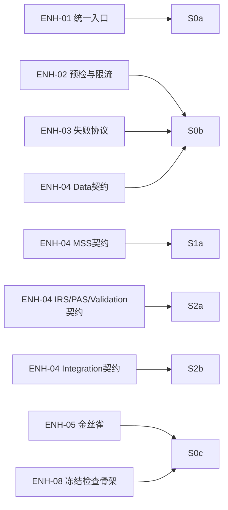

# EmotionQuant S0-S2r 真螺旋执行路线图（执行版 v1.3）

**状态**: Completed（2026-02-21 复核通过，完整版可实战）  
**更新时间**: 2026-02-21  
**适用范围**: S0-S2r（数据层到核心算法深化与修复闭环）  
**文档角色**: S0-S2r 执行合同（不是上位 SoT 替代）

---

## 完成态复核（2026-02-21）

- 复核结论：`S0-S2r` 路线图覆盖项已完成设计到代码的完整转化，满足“完整版、可实战”口径。
- 核心算法与关键语义已落地：
  - Integration 四模式：`top_down/bottom_up/dual_verify/complementary`（`src/integration/pipeline.py`、`src/pipeline/main.py`）
  - 推荐硬约束：每日最多 `20`、单行业最多 `5`（`src/integration/pipeline.py`）
  - MSS 历史排序字段：`mss_rank/mss_percentile` 正式落库（`src/algorithms/mss/engine.py`、`src/algorithms/mss/pipeline.py`）
- 复核测试与门禁：
  - `python -m scripts.quality.local_quality_check --contracts --governance`（通过）
  - `pytest tests/unit/integration/test_integration_contract.py -q`（通过）
  - `pytest tests/unit/integration/test_quality_gate_contract.py -q`（通过）
  - `pytest tests/unit/integration/test_validation_gate_contract.py -q`（通过）
  - `pytest tests/unit/algorithms/mss/test_mss_full_semantics_contract.py -q`（通过）
  - `pytest tests/unit/integration/test_algorithm_semantics_regression.py -q`（通过）
- 维护规则：若任一契约/语义回归失败，必须将状态回退为 `blocked` 并进入对应修复微圈（含 `S2r`）。

---

## 0. 文档定位（先对齐 SoT）

冲突处理优先级（从高到低）：

1. `docs/design/enhancements/eq-improvement-plan-core-frozen.md`（唯一执行基线）
2. `Governance/SpiralRoadmap/planA/VORTEX-EVOLUTION-ROADMAP.md`（能力状态 SoT）
3. `Governance/steering/6A-WORKFLOW.md` + `Governance/steering/系统铁律.md`
4. `Governance/SpiralRoadmap/SPIRAL-STAGE-TEMPLATES.md`（阶段A/B/C 门禁模板）
5. 本文件（S0-S2r 微圈执行合同）

本文件只负责两件事：

- 把 S0-S2r 拆成可收口微圈
- 给每圈定义可审计的 `run/test/artifact/review/sync` 合同

---

## 1. 现实基线快照（As-Is, 2026-02-21）

1. `eq` 统一入口已落地：`src/pipeline/main.py` 已覆盖 `run/mss/mss-probe/recommend/fetch/backtest/trade/analysis` 子命令。
2. `python -m src.pipeline.main` 已可执行业务路径（不再是 `NotImplementedError`）。
3. S0/S1 合同测试已落地：`tests/unit/pipeline/test_cli_entrypoint.py`、`tests/unit/algorithms/mss/test_mss_contract.py`、`tests/unit/algorithms/mss/test_mss_probe_contract.py`、`tests/unit/integration/test_mss_integration_contract.py`。
4. 本地质量门禁脚本可执行：`python -m scripts.quality.local_quality_check --contracts --governance`（必要）与 `--scan`（可选补充）。
5. CI 质量门禁已存在：`.github/workflows/quality-gates.yml`。
6. S2“完全版必须补项”已代码落地：`integration_mode` 四模式（`top_down/bottom_up/dual_verify/complementary`）、推荐硬约束（每日最多 20 / 行业最多 5）、`mss_rank/mss_percentile` 正式落库。

执行口径采用双层：

- `baseline command/test`：当前仓库立即可执行，用于圈前健康检查。
- `target command/test`：本圈收口必须成立；若当前不存在，需在本圈补齐。

---

## 2. 收口定义（硬门禁）

每个微圈必须满足 5 件套，否则不能标记完成：

1. `run`: 核心命令成功。
2. `test`: 自动化测试通过。
3. `artifact`: 产物可定位且可复核。
4. `review`: 复盘完成。
5. `sync`: 最小 5 文件同步完成。

附加强制项：

- `consumption`: 记录“谁消费/怎么消费/消费结论”。
- `gate`: 门禁结论（PASS/WARN/FAIL）与阻断理由。
- `contracts`: 契约/治理一致性检查通过（`python -m scripts.quality.local_quality_check --contracts --governance`）。

### 2.1 防跑偏硬门禁（新增）

为避免“实现看起来能跑但语义被改写”，S0-S2 每圈收口前必须额外满足：

1. 行为回归通过：`.\.venv\Scripts\pytest.exe tests/unit/scripts/test_contract_behavior_regression.py -q`
2. 治理一致性通过：`.\.venv\Scripts\pytest.exe tests/unit/scripts/test_governance_consistency_check.py -q`
3. 若任一失败：圈状态必须标记 `blocked`，只允许进入修复子圈，不允许推进到下一主圈。

统一证据目录：

`artifacts/spiral-{spiral_id}/{trade_date}/`

最小证据文件：

- `run.log`
- `test.log`
- `gate_report.md`
- `consumption.md`
- `review.md`
- `sync_checklist.md`

---

## 3. 执行参数与兼容规则

参数占位符：

- `{trade_date}`: 交易日 `YYYYMMDD`
- `{start}` / `{end}`: 回溯窗口（交易日口径）

入口兼容规则：

1. S0a 完成前，允许 `python -m ...` 临时入口。
2. S0a 收口后，`eq` 必须成为统一入口。
3. 若 `eq` 与模块命令不一致，以 `eq` 为修复目标并阻断收口。

全圈 baseline（圈前必须执行）：

```bash
.\.venv\Scripts\python.exe --version
.\.venv\Scripts\python.exe -m scripts.quality.local_quality_check --contracts --governance
.\.venv\Scripts\python.exe -m scripts.quality.local_quality_check --scan
.\.venv\Scripts\pytest.exe tests/unit/config tests/unit/data/models -q
```

可选兼容（当环境临时目录权限受限时）：

```powershell
$env:PYTEST_ADDOPTS="--basetemp ./.tmp/pytest"
```

---

## 4. S0-S2r 微圈总览（实战口径）

| Spiral | 主目标 | CP Slice（1-3） | 预算 | 前置 | 退出去向 |
|---|---|---|---:|---|---|
| S0a | 统一入口与配置注入可用 | CP-01 | 2d | 无 | S0b |
| S0b | L1 采集入库闭环 | CP-01 | 3d | S0a | S0c |
| S0c | L2 快照与失败链路闭环 | CP-01 | 3d | S0b | S1a |
| S1a | MSS 最小评分可跑 | CP-02 | 3d | S0c | S1b |
| S1b | MSS 消费验证闭环 | CP-02, CP-05 | 2d | S1a | S2a |
| S2a | IRS + PAS + Validation 最小闭环 | CP-03, CP-04, CP-10 | 4d | S1b | S2b |
| S2b | MSS+IRS+PAS 集成推荐闭环 | CP-05 | 3d | S2a | S2c 或 S2r |
| S2c | 核心算法深化闭环（权重桥接 + 语义收口） | CP-02, CP-03, CP-04, CP-10, CP-05 | 3-4d | S2b PASS/WARN | S3a 或 S2r |
| S2r | 质量门失败修复子圈 | CP-02, CP-03, CP-04, CP-05, CP-10 | 1-2d | S2b/S2c FAIL | 回 S2b 或 S2c |

说明：默认 7 天 cadence 不变；上述微圈是 7 天内可组合执行单元。

### 4.1 S1 阶段任务边界（新增）

- S1 阶段完整任务仅包含两圈：`S1a`（MSS 评分产出）+ `S1b`（MSS 消费验证）。
- `Governance/SpiralRoadmap/planA/execution-cards/S1A-EXECUTION-CARD.md` 与 `Governance/SpiralRoadmap/planA/execution-cards/S1B-EXECUTION-CARD.md` 是 S1 阶段的完整执行卡，不包含 S0 任务。
- S1 的责任边界是“可消费的 MSS 产出与消费证据”，不是实盘交易闭环；实盘责任由 S2+（Integration/Backtest/Trading）承担。

### 4.2 ENH 显式映射（新增）

为提高 S0-S2r 的 ENH 可追溯性，补充以下“ENH -> Spiral”显式映射：

| ENH | 名称 | 本阶段落位 Spiral | 说明 |
|---|---|---|---|
| ENH-01 | 统一运行入口 CLI | S0a | 统一 `eq` 入口与配置注入 |
| ENH-02 | 数据预检与限流 | S0b | L1 采集前置预检与限流守卫 |
| ENH-03 | 失败产物协议 | S0b | 统一 `error_manifest.json` 等失败证据 |
| ENH-04 | 适配层契约测试 | S0b, S1a, S2a, S2b | Data/MSS/IRS-PAS-Validation/Integration 分批落位 |
| ENH-05 | 金丝雀数据包 | S0c | 通过 `test_s0_canary` 验证最小回归链路 |
| ENH-08 | 设计冻结检查（骨架） | S0c | 阶段A先建骨架，S6 再做全量执行 |



### 4.3 S2 完全版必须满足的设计语义条目（硬门禁）

以下条目任一未满足，S2 不得标记“完全版完成”：

1. Integration 必须支持并可审计四模式：`top_down` / `bottom_up` / `dual_verify` / `complementary`，并在输出中记录 `integration_mode`。
2. 推荐硬约束必须强制执行：每日最多 `20`，单行业最多 `5`，且 S/A 优先排序可复核。
3. MSS 必须输出并落库历史排序字段：`mss_rank` 与 `mss_percentile`（基于温度序列计算），不得仅停留在文档语义。
4. Validation -> Integration 桥接必须可审计：`selected_weight_plan -> validation_weight_plan.plan_id -> integrated_recommendation.weight_plan_id`。
5. 执行边界必须一致：`contract_version=nc-v1`，`risk_reward_ratio>=1.0`，A 股规则字段可追溯。

---

## 5. 各圈执行合同（v1.1）

### S0a

- 主目标：统一入口与配置注入可运行。
- 执行卡：`Governance/SpiralRoadmap/planA/execution-cards/S0A-EXECUTION-CARD.md`
- `baseline test`：`.\.venv\Scripts\pytest.exe tests/unit/config/test_config_defaults.py tests/unit/config/test_env_docs_alignment.py -q`
- `target command`：
  - `python -m src.pipeline.main --help`（临时入口）
  - `eq --help`（统一入口）
- `target test`（本圈必须补齐并执行）：`tests/unit/pipeline/test_cli_entrypoint.py`
- 门禁：
  - `eq` 命令可调用。
  - 路径读取全部来自 `Config.from_env()`。
  - 配置快照必须包含 `flat_threshold/min_coverage_ratio/stale_hard_limit_days`。
- 产物：`cli_contract.md`, `config_effective_values.json`
- 消费：S0b 记录“通过统一入口触发采集”。

### S0b

- 主目标：L1 原始数据采集、入库与就绪门禁闭环。
- 执行卡：`Governance/SpiralRoadmap/planA/execution-cards/S0B-EXECUTION-CARD.md`
- `baseline test`：`.\.venv\Scripts\pytest.exe tests/unit/data/models/test_model_contract_alignment.py -q`
- `target command`：`eq run --date {trade_date} --source tushare --l1-only`
- `target test`（本圈必须补齐并执行）：`tests/unit/data/test_fetcher_contract.py tests/unit/data/test_l1_repository_contract.py tests/unit/data/test_data_readiness_persistence_contract.py`
- 门禁：
  - `raw_daily` 当日记录数 `> 0`。
  - `raw_trade_cal` 含 `{trade_date}`。
  - 失败输出 `error_manifest.json`。
  - `system_config/data_quality_report/data_readiness_gate` 必须落库。
- 产物：`raw_counts.json`, `fetch_retry_report.md`, `error_manifest_sample.json`, `l1_quality_gate_report.md`
- 消费：S0c 记录“L1 -> L2 读取链路”。

### S0c

- 主目标：L2 快照、SW31 语义与错误分级闭环。
- 执行卡：`Governance/SpiralRoadmap/planA/execution-cards/S0C-EXECUTION-CARD.md`
- `baseline test`：`.\.venv\Scripts\pytest.exe tests/unit/data/models/test_snapshots.py -q`
- `target command`：`eq run --date {trade_date} --source tushare --to-l2 --strict-sw31`
- `target test`（本圈必须补齐并执行）：`tests/unit/data/test_snapshot_contract.py tests/unit/data/test_s0_canary.py tests/unit/data/test_industry_snapshot_sw31_contract.py tests/unit/data/test_data_readiness_persistence_contract.py tests/unit/data/test_flat_threshold_config_contract.py`
- 门禁：
  - `market_snapshot` 当日存在。
  - `industry_snapshot` 当日必须是 SW31 31 行业（禁止 `industry_code=ALL`）。
  - 字段含 `data_quality/stale_days/source_trade_date`。
  - `flat_count` 必须遵循 `flat_threshold`（来自 `system_config`）。
  - `data_readiness_gate.status in (ready,degraded)`，`blocked` 必须阻断后续圈。
  - 失败流程包含 `error_level`。
- 产物：`market_snapshot_sample.parquet`, `industry_snapshot_sample.parquet`, `s0_canary_report.md`, `sw_mapping_audit.md`, `l2_quality_gate_report.md`
- 消费：S1a 记录“L2 作为 MSS 输入”。

### S1a

- 主目标：MSS 最小评分可跑。
- 执行卡：`Governance/SpiralRoadmap/planA/execution-cards/S1A-EXECUTION-CARD.md`
- `baseline test`：`.\.venv\Scripts\pytest.exe tests/unit/data/models/test_snapshots.py -q`
- `target command`：`eq mss --date {trade_date}`
- `target test`（本圈必须补齐并执行）：`tests/unit/algorithms/mss/test_mss_contract.py tests/unit/algorithms/mss/test_mss_engine.py`
- 门禁：
  - `mss_panorama` 当日记录数 `> 0`。
  - 字段含 `mss_score/mss_temperature/mss_cycle/mss_rank/mss_percentile/mss_trend_quality`。
- 产物：`mss_panorama_sample.parquet`, `mss_factor_trace.md`
- 消费：S1b 记录“MSS 输出被回溯探针消费”。

### S1b

- 主目标：MSS 消费验证闭环（非只算分）。
- 执行卡：`Governance/SpiralRoadmap/planA/execution-cards/S1B-EXECUTION-CARD.md`
- `baseline test`：`.\.venv\Scripts\pytest.exe tests/unit/config/test_config_defaults.py -q`
- `target command`：`eq mss-probe --start {start} --end {end}`
- `target test`（本圈必须补齐并执行）：`tests/unit/algorithms/mss/test_mss_probe_contract.py tests/unit/integration/test_mss_integration_contract.py`
- 门禁：
  - 产出 `mss_only_probe_report`。
  - 包含 `top_bottom_spread_5d` 与结论。
- 产物：`mss_only_probe_report.md`, `mss_consumption_case.md`
- 消费：S2a 记录“IRS/PAS 叠加前使用 S1b 结论”。

### S2a

- 主目标：IRS + PAS + Validation 最小闭环。
- 执行卡：`Governance/SpiralRoadmap/planA/execution-cards/S2A-EXECUTION-CARD.md`
- `baseline test`：`.\.venv\Scripts\pytest.exe tests/unit/config/test_dependency_manifest.py -q`
- `target command`：`eq recommend --date {trade_date} --mode mss_irs_pas --with-validation`
- `target test`（本圈必须补齐并执行）：`tests/unit/algorithms/irs/test_irs_contract.py tests/unit/algorithms/pas/test_pas_contract.py tests/unit/integration/test_validation_gate_contract.py`
- 门禁：
  - `irs_industry_daily` 当日记录数 `> 0`。
  - `stock_pas_daily` 当日记录数 `> 0`。
  - `validation_gate_decision` 当日可追溯。
  - `validation_gate_decision.contract_version = "nc-v1"`。
  - FAIL 必须产出 `validation_prescription`。
- 产物：`irs_industry_daily_sample.parquet`, `stock_pas_daily_sample.parquet`, `validation_gate_decision_sample.parquet`
- 消费：S2b 记录“使用 gate 决策驱动集成”。

### S2b

- 主目标：MSS+IRS+PAS 集成推荐闭环。
- 执行卡：`Governance/SpiralRoadmap/planA/execution-cards/S2B-EXECUTION-CARD.md`
- `baseline test`：`.\.venv\Scripts\pytest.exe tests/unit/config/test_env_docs_alignment.py -q`
- `target command`：
  - `eq recommend --date {trade_date} --mode integrated --integration-mode top_down`
  - `eq recommend --date {trade_date} --mode integrated --integration-mode bottom_up`
  - `eq recommend --date {trade_date} --mode integrated --integration-mode dual_verify`
  - `eq recommend --date {trade_date} --mode integrated --integration-mode complementary`
- `target test`（本圈必须补齐并执行）：`tests/unit/integration/test_integration_contract.py tests/unit/integration/test_quality_gate_contract.py`
- 门禁：
  - `integrated_recommendation` 当日记录数 `> 0`。
  - `integration_mode` 必须仅取 `{top_down,bottom_up,dual_verify,complementary}` 且可追溯。
  - 推荐硬约束生效：每日最多 `20`、单行业最多 `5`。
  - `quality_gate_report.status in (PASS, WARN)`。
  - 契约版本兼容：`contract_version = "nc-v1"`。
  - RR 执行边界一致：`risk_reward_ratio >= 1.0`（`<1.0` 必须被执行层过滤）。
  - A 股规则字段可追溯：`t1_restriction_hit`、`limit_guard_result`、`session_guard_result`。
  - FAIL 不得进入 S2c/S3a/S3，必须进入 S2r。
- 产物：`integrated_recommendation_sample.parquet`, `quality_gate_report.md`, `s2_go_nogo_decision.md`
- 消费：S2c 记录“核心算法语义深化与权重桥接消费 S2b 输出”。

### S2c

- 主目标：核心算法深化闭环，完成 `validation_weight_plan` 桥接并收口算法语义。
- 执行卡：`Governance/SpiralRoadmap/planA/execution-cards/S2C-EXECUTION-CARD.md`
- `baseline test`：`.\.venv\Scripts\pytest.exe tests/unit/integration/test_validation_gate_contract.py tests/unit/integration/test_integration_contract.py -q`
- `target command`：`eq recommend --date {trade_date} --mode integrated --with-validation-bridge`
- `target test`（本圈必须补齐并执行）：`tests/unit/algorithms/validation/test_weight_plan_bridge_contract.py tests/unit/integration/test_validation_weight_plan_bridge.py tests/unit/integration/test_algorithm_semantics_regression.py`
- 门禁：
  - Validation 产物齐备并可追溯：`validation_factor_report`、`validation_weight_report`、`validation_gate_decision`、`validation_weight_plan`、`validation_run_manifest`。
  - `validation_gate_decision.selected_weight_plan` 可解析到 `validation_weight_plan.plan_id`。
  - `integrated_recommendation.weight_plan_id` 与选中计划一致，且 `w_mss/w_irs/w_pas` 可复核。
  - MSS 语义字段 `mss_rank/mss_percentile/mss_trend_quality` 必须可追溯。
  - Integration 四模式与推荐硬约束必须通过契约回归。
  - 桥接缺失或不一致必须阻断，状态标记 `blocked`，不得推进 S3a/S3。
  - `contract_version = "nc-v1"` 且 `risk_reward_ratio >= 1.0` 执行边界一致。
- 产物：`validation_factor_report_sample.parquet`, `validation_weight_report_sample.parquet`, `validation_weight_plan_sample.parquet`, `s2c_algorithm_closeout.md`
- 消费：S3a 或 S3 记录“回测仅消费已完成桥接与语义收口的推荐结果”。

### S2r（条件触发）

- 触发：S2b 或 S2c `gate = FAIL`
- 主目标：只修不扩，恢复可通过质量门。
- 执行卡：`Governance/SpiralRoadmap/planA/execution-cards/S2R-EXECUTION-CARD.md`
- `baseline test`：`.\.venv\Scripts\pytest.exe tests/unit/config/test_dependency_manifest.py -q`
- `target command`：`eq recommend --date {trade_date} --mode integrated --repair s2r`
- `target test`（本圈必须补齐并执行）：`tests/unit/integration/test_validation_gate_contract.py tests/unit/integration/test_quality_gate_contract.py`
- 门禁：
  - `quality_gate_report.status in (PASS, WARN)`。
  - 必须产出 `s2r_patch_note` 与 `s2r_delta_report`。
- 产物：`s2r_patch_note.md`, `s2r_delta_report.md`
- 消费：返回 S2b 重验并记录“修复前后差异结论”。

---

## 6. 状态推进与降级规则

状态定义：

- `planned`：已排期未执行
- `in_progress`：执行中
- `blocked`：被门禁阻断
- `completed`：收口完成

推进规则：

1. 5 件套未齐，不得 `completed`。
2. `consumption.md` 缺失，不得 `completed`。
3. `blocked` 超过 1 天，必须在 `review.md` 提交降级策略。
4. S2b/S2c FAIL 仅允许进入 S2r，不允许跳过进入后续圈。
5. `contracts` 检查未通过时，状态必须标记 `blocked`，不得推进到 S2c/S3a/S3。
6. S2c 未完成时，不得推进到 S3a/S3。

---

## 7. 首轮启动（立即可执行）

执行顺序：

1. 跑 baseline command/test（环境健康检查）。
2. 启动 S0a（统一入口与配置）。
3. S0a 完成后进入 S0b。

启动命令：

```bash
.\.venv\Scripts\python.exe --version
.\.venv\Scripts\python.exe -m scripts.quality.local_quality_check --contracts --governance
.\.venv\Scripts\python.exe -m scripts.quality.local_quality_check --scan
.\.venv\Scripts\pytest.exe tests/unit/config tests/unit/data/models -q
```

---

## 8. 最小同步（每圈固定）

每圈收口后必须同步：

1. `Governance/specs/spiral-{spiral_id}/final.md`
2. `Governance/record/development-status.md`
3. `Governance/record/debts.md`
4. `Governance/record/reusable-assets.md`
5. `Governance/SpiralRoadmap/planA/VORTEX-EVOLUTION-ROADMAP.md`

---

## 9. 与后续实战圈衔接

- S2b PASS 后默认进入 `S2c`（核心算法深化闭环）。
- S2c PASS 后默认进入 `S3a`（ENH-10 数据采集增强）。
- 完整多路线执行方案见：`Governance/SpiralRoadmap/planA/SPIRAL-PRODUCTION-ROUTES.md`。

---

## 10. 变更记录

| 版本 | 日期 | 变更说明 |
|---|---|---|
| v1.3 | 2026-02-21 | 升级“完全版”口径：新增 S2 设计语义硬门禁（Integration 四模式、推荐数量硬约束、MSS rank/percentile 落库）；同步 S1a/S2b/S2c 合同条款与命令矩阵 |
| v1.2 | 2026-02-21 | 修复 S1 对齐：明确 S1 阶段边界（S1a+S1b）；更新 As-Is 快照为当前实现状态；S1b 产物目录统一为 `{start}_{end}` |
| v1.1 | 2026-02-21 | S0 执行合同升级为实战口径：S0b/S0c 增补 `system_config/data_quality_report/data_readiness_gate` 持久化门禁；S0c 默认命令切为 `--strict-sw31` 并新增 `flat_threshold` 契约测试 |
| v1.0 | 2026-02-17 | 增补“ENH 显式映射”与 mermaid 追踪图，明确 S0-S2c 阶段 ENH-01/02/03/04/05/08 的落位与可追溯关系 |
| v0.9 | 2026-02-16 | 新增 S2c（S2b->S3a）核心算法深化圈；把 `validation_weight_plan` 桥接升级为 S2 出口硬门禁；同步阶段A推进规则 |
| v0.8 | 2026-02-15 | 执行卡体系补齐：新增 S0b/S0c/S1a/S1b/S2a/S2b/S2r 一页执行卡并在各圈合同挂接引用 |
| v0.7 | 2026-02-15 | S0a 执行合同补充一页执行卡引用（`Governance/SpiralRoadmap/planA/execution-cards/S0A-EXECUTION-CARD.md`），用于当天 run/test/artifact/review/sync 快速收口 |
| v0.6 | 2026-02-15 | SoT 优先级补充阶段模板文档引用（`SPIRAL-STAGE-TEMPLATES.md`），明确阶段门禁与微圈合同联动 |
| v0.5 | 2026-02-15 | 新增“防跑偏硬门禁”小节：将行为回归与治理一致性测试设为每圈收口强制条件，失败时只允许进入修复子圈 |
| v0.4 | 2026-02-14 | 基线快照升级到“契约门禁已落地”口径：补充 contracts/governance 本地检查与 CI 门禁；S2a/S2b 门禁补充 `contract_version=nc-v1` 与 RR 执行边界；推进规则新增 contracts 阻断条件 |
| v0.3 | 2026-02-13 | 升级为实战口径：纳入 PAS（CP-04）、补 A 股规则门禁、修复基线可执行描述、补充与 S3a 衔接 |
| v0.2 | 2026-02-13 | 修复可执行性断点：补 SoT 定位、引入 baseline/target 双命令口径、补 CP Slice、统一参数占位符、重写微圈合同 |
| v0.1 | 2026-02-13 | 初稿 |


