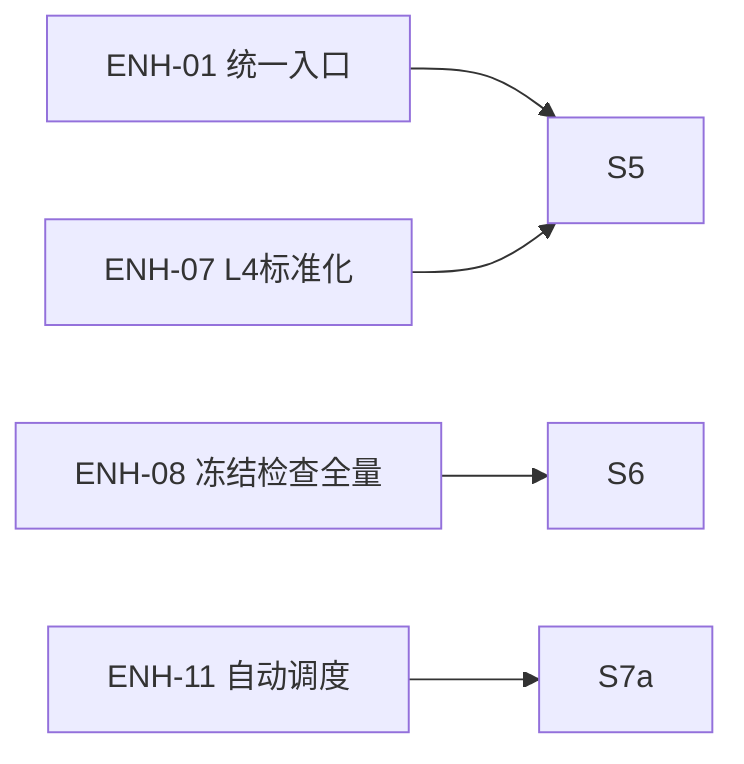

# EmotionQuant S5-S7a 真螺旋执行路线图（执行版 v0.4）

**状态**: Active  
**更新时间**: 2026-02-20  
**适用范围**: S5-S7a（阶段C：展示闭环、稳定化闭环、自动调度闭环）  
**文档角色**: S5-S7a 执行合同（不是上位 SoT 替代）

---

## 0. 文档定位（先对齐 SoT）

冲突处理优先级（从高到低）：

1. `docs/design/enhancements/eq-improvement-plan-core-frozen.md`（唯一执行基线）
2. `Governance/Capability/SPIRAL-CP-OVERVIEW.md`（路线主控）
3. `Governance/steering/6A-WORKFLOW.md` + `Governance/steering/系统铁律.md`
4. `Governance/SpiralRoadmap/SPIRAL-STAGE-TEMPLATES.md`（阶段A/B/C 门禁模板）
5. 本文件（S5-S7a 微圈执行合同）

本文件只负责两件事：

- 把 S5-S7a 拆成可收口微圈
- 给每圈定义可审计的 `run/test/artifact/review/sync` 合同

---

## 1. 现实基线快照（As-Is, 2026-02-16）

1. 阶段A（S0-S2c）需先完成算法收口与桥接硬门禁，阶段B（S3a-S4b）执行合同已落位，阶段C目标可在前置门禁满足后推进（见 `Governance/SpiralRoadmap/planA/SPIRAL-S3A-S4B-EXECUTABLE-ROADMAP.md` 与 `Governance/record/development-status.md`）。
2. `eq` 统一入口当前已支持 `run/mss/mss-probe/recommend`，阶段C目标命令（`gui/run-all/scheduler`）尚未完成接入。
3. `src/gui`、全链路重跑一致性守卫、调度安装与运行态可观测能力仍需在阶段C补齐。
4. 已存在且可复用的门禁测试主路径：`tests/unit/config/*`、`tests/unit/integration/*`、`tests/unit/scripts/test_local_quality_check.py`、`tests/unit/scripts/test_contract_behavior_regression.py`、`tests/unit/scripts/test_governance_consistency_check.py`。
5. 阶段C推进前，必须保证阶段B输出可消费：`backtest_results`、`trade_records`、`ab_benchmark_report`、`extreme_defense_report`。
6. 阶段C执行卡已补齐并挂接：`S5/S5R/S6/S6R/S7A/S7AR-EXECUTION-CARD.md`。

执行口径采用双层：

- `baseline command/test`：当前仓库立即可执行，用于圈前健康检查。
- `target command/test`：本圈收口必须成立；若当前不存在，需在本圈补齐。

---

## 2. 收口定义（硬门禁）

每个微圈必须满足 5 件套，否则不能标记完成：

1. `run`: 核心命令成功。
2. `test`: 自动化测试通过。
3. `artifact`: 产物可定位且可复核。
4. `review`: 复盘完成。
5. `sync`: 最小 5 文件同步完成。

附加强制项：

- `consumption`: 记录“谁消费/怎么消费/消费结论”。
- `gate`: 门禁结论（PASS/WARN/FAIL）与阻断理由。
- `contracts`: 契约/治理一致性检查通过（`python -m scripts.quality.local_quality_check --contracts --governance`）。

### 2.1 防跑偏硬门禁（阶段C必过）

为避免“展示与运维功能上线但核心语义被改写”，S5-S7a 每圈收口前必须额外满足：

1. 行为回归通过：`.\.venv\Scripts\pytest.exe tests/unit/scripts/test_contract_behavior_regression.py -q`
2. 治理一致性通过：`.\.venv\Scripts\pytest.exe tests/unit/scripts/test_governance_consistency_check.py -q`
3. 若任一失败：圈状态必须标记 `blocked`，只允许进入修复子圈，不允许推进到下一主圈。

统一证据目录：

`artifacts/spiral-{spiral_id}/{trade_date}/`

最小证据文件：

- `run.log`
- `test.log`
- `gate_report.md`
- `consumption.md`
- `review.md`
- `sync_checklist.md`

---

## 3. 执行参数与兼容规则

参数占位符：

- `{trade_date}`: 交易日 `YYYYMMDD`
- `{start}` / `{end}`: 全链路重跑窗口（交易日口径）

入口兼容规则：

1. 阶段C命令完成接入前，允许使用临时模块入口进行开发验证。
2. 各圈收口后，对应 `eq` 子命令必须成为统一入口。
3. 若 `eq` 与临时模块命令行为不一致，以 `eq` 为修复目标并阻断收口。

全圈 baseline（圈前必须执行）：

```bash
.\.venv\Scripts\python.exe --version
.\.venv\Scripts\python.exe -m scripts.quality.local_quality_check --contracts --governance
.\.venv\Scripts\python.exe -m scripts.quality.local_quality_check --scan
.\.venv\Scripts\pytest.exe tests/unit/config tests/unit/integration -q
.\.venv\Scripts\pytest.exe tests/unit/scripts/test_contract_behavior_regression.py tests/unit/scripts/test_governance_consistency_check.py -q
```

可选兼容（当环境临时目录权限受限时）：

```powershell
$env:PYTEST_ADDOPTS="--basetemp ./.tmp/pytest"
```

---

## 4. S5-S7a 微圈总览（阶段C口径）

| Spiral | 主目标 | CP Slice（1-3） | 预算 | 前置 | 退出去向 |
|---|---|---|---:|---|---|
| S5 | 展示闭环（GUI + 日报导出） | CP-08, CP-09 | 3d | S4b PASS/WARN | S6 或 S5r |
| S5r | 展示修复子圈 | CP-08, CP-09 | 1-2d | S5 FAIL | 回 S5 |
| S6 | 稳定化闭环（重跑一致性 + 债务清偿） | CP-10, CP-07, CP-09 | 3d | S5 PASS/WARN | S7a 或 S6r |
| S6r | 稳定化修复子圈 | CP-10, CP-07, CP-09 | 1-2d | S6 FAIL | 回 S6 |
| S7a | ENH-11 自动调度闭环 | CP-01, CP-07 | 1.5d | S6 PASS/WARN | release 或 S7ar |
| S7ar | 调度修复子圈 | CP-01, CP-07 | 1d | S7a FAIL | 回 S7a |

说明：默认 7 天 cadence 不变；上述微圈是 7 天内可组合执行单元。

### 4.1 ENH 显式映射（新增）

为提高 S5-S7a 的 ENH 可追溯性，补充以下“ENH -> Spiral”显式映射：

| ENH | 名称 | 本阶段落位 Spiral | 说明 |
|---|---|---|---|
| ENH-01 | 统一运行入口 CLI | S5 | 阶段C命令统一到 `eq gui`/`eq run-all`/`eq scheduler` |
| ENH-07 | L4 产物标准化 | S5 | GUI 与日报导出按统一产物口径收口 |
| ENH-08 | 设计冻结检查（全量） | S6 | 全链路重跑一致性与设计冻结守卫 |
| ENH-11 | 定时调度器 | S7a | 调度安装、幂等、运行历史可审计 |



---

## 5. 各圈执行合同（v0.2）

### S5

- 执行卡：`Governance/SpiralRoadmap/planA/execution-cards/S5-EXECUTION-CARD.md`
- 主目标：GUI 可启动、只读展示、日报可导出。
- `baseline test`：`.\.venv\Scripts\pytest.exe tests/unit/integration/test_integration_contract.py -q`
- `target command`：
  - `eq gui --date {trade_date}`
  - `eq gui --date {trade_date} --export daily-report`
- `target test`（本圈必须补齐并执行）：`tests/unit/gui/test_gui_launch_contract.py tests/unit/gui/test_gui_readonly_contract.py tests/unit/analysis/test_daily_report_export_contract.py`
- 门禁：
  - GUI 启动成功，且不在页面层执行算法计算。
  - `daily_report` 导出成功，且可追溯到 L1/L2/L3 输入与参数。
  - 展示口径与阶段B归因/防御参数一致，不得出现手工覆盖。
  - `status in (PASS, WARN)`。
- 产物：`gui_snapshot.png`, `daily_report_sample.md`, `gui_export_manifest.json`
- 消费：S6 记录“稳定化重跑基于 S5 统一展示口径”。

### S5r（条件触发）

- 执行卡：`Governance/SpiralRoadmap/planA/execution-cards/S5R-EXECUTION-CARD.md`
- 触发：S5 `gate = FAIL`
- 主目标：修复展示闭环阻断项并重验。
- `baseline test`：`.\.venv\Scripts\pytest.exe tests/unit/gui tests/unit/analysis -q`
- `target command`：`eq gui --date {trade_date} --repair s5r`
- `target test`（本圈必须补齐并执行）：`tests/unit/gui/test_gui_launch_contract.py tests/unit/analysis/test_daily_report_export_contract.py`
- 门禁：
  - `status in (PASS, WARN)`。
  - 必须产出 `s5r_patch_note` 与 `s5r_delta_report`。
- 产物：`s5r_patch_note.md`, `s5r_delta_report.md`
- 消费：返回 S5 重验并记录“修复前后展示与导出差异”。

### S6

- 执行卡：`Governance/SpiralRoadmap/planA/execution-cards/S6-EXECUTION-CARD.md`
- 主目标：全链路重跑一致性通过，并完成阶段债务清偿记录。
- `baseline test`：`.\.venv\Scripts\pytest.exe tests/unit/integration -q`
- `target command`：`eq run-all --start {start} --end {end}`
- `target test`（本圈必须补齐并执行）：`tests/unit/integration/test_full_chain_contract.py tests/unit/integration/test_replay_reproducibility.py tests/unit/scripts/test_design_freeze_guard.py`
- 门禁：
  - 同窗口重跑关键产物一致（或差异在阈值内并有解释）。
  - 输出一致性报告，覆盖推荐/回测/交易/分析关键链路。
  - 债务清偿记录完成，残留债务有明确延期原因。
  - `status in (PASS, WARN)`。
- 产物：`consistency_replay_report.md`, `run_all_diff_report.md`, `debt_settlement_log.md`
- 消费：S7a 记录“调度上线依赖 S6 稳定基线”。

### S6r（条件触发）

- 执行卡：`Governance/SpiralRoadmap/planA/execution-cards/S6R-EXECUTION-CARD.md`
- 触发：S6 `gate = FAIL`
- 主目标：只修不扩，恢复稳定化门禁通过。
- `baseline test`：`.\.venv\Scripts\pytest.exe tests/unit/integration tests/unit/scripts -q`
- `target command`：`eq run-all --start {start} --end {end} --repair s6r`
- `target test`（本圈必须补齐并执行）：`tests/unit/integration/test_replay_reproducibility.py tests/unit/scripts/test_design_freeze_guard.py`
- 门禁：
  - `status in (PASS, WARN)`。
  - 必须产出 `s6r_patch_note` 与 `s6r_delta_report`。
- 产物：`s6r_patch_note.md`, `s6r_delta_report.md`
- 消费：返回 S6 重验并记录“修复前后重跑差异”。

### S7a

- 执行卡：`Governance/SpiralRoadmap/planA/execution-cards/S7A-EXECUTION-CARD.md`
- 主目标：每日自动调度可安装、可观测、可去重。
- `baseline test`：`.\.venv\Scripts\pytest.exe tests/unit/config/test_env_docs_alignment.py -q`
- `target command`：
  - `eq scheduler install`
  - `eq scheduler status`
  - `eq scheduler run-once`
- `target test`（本圈必须补齐并执行）：`tests/unit/pipeline/test_scheduler_install_contract.py tests/unit/pipeline/test_scheduler_calendar_idempotency.py tests/unit/pipeline/test_scheduler_run_history_contract.py`
- 门禁：
  - 调度安装与状态查询可用。
  - 非交易日自动跳过，交易日重复任务幂等去重。
  - 失败重试、运行历史、最近结果可审计。
  - 调度层不改业务语义，仅做编排与运维增强。
  - `status in (PASS, WARN)`。
- 产物：`scheduler_status.json`, `scheduler_run_history.md`, `scheduler_bootstrap_checklist.md`
- 消费：release 记录“阶段C收口并进入日常运维节奏”。

### S7ar（条件触发）

- 执行卡：`Governance/SpiralRoadmap/planA/execution-cards/S7AR-EXECUTION-CARD.md`
- 触发：S7a `gate = FAIL`
- 主目标：修复调度阻断项并重验。
- `baseline test`：`.\.venv\Scripts\pytest.exe tests/unit/pipeline -q`
- `target command`：`eq scheduler run-once --repair s7ar`
- `target test`（本圈必须补齐并执行）：`tests/unit/pipeline/test_scheduler_calendar_idempotency.py tests/unit/pipeline/test_scheduler_run_history_contract.py`
- 门禁：
  - `status in (PASS, WARN)`。
  - 必须产出 `s7ar_patch_note` 与 `s7ar_delta_report`。
- 产物：`s7ar_patch_note.md`, `s7ar_delta_report.md`
- 消费：返回 S7a 重验并记录“修复前后调度稳定性差异”。

---

## 6. 状态推进与降级规则

状态定义：

- `planned`：已排期未执行
- `in_progress`：执行中
- `blocked`：被门禁阻断
- `completed`：收口完成

推进规则：

1. 5 件套未齐，不得 `completed`。
2. `consumption.md` 缺失，不得 `completed`。
3. `blocked` 超过 1 天，必须在 `review.md` 提交降级策略。
4. S5/S6/S7a FAIL 必须先进入对应修复子圈（S5r/S6r/S7ar），不得跳过推进。
5. `contracts` 检查未通过时，状态必须标记 `blocked`，不得标记阶段C完成。
6. 若发现阶段B归因参数与极端防御基线失真，必须回退阶段B重校准后再返回阶段C。

---

## 7. 首轮启动（立即可执行）

执行顺序：

1. 跑 baseline command/test（环境健康检查）。
2. 启动 S5（GUI + 日报导出）。
3. S5 完成后进入 S6（稳定化重跑一致性）。
4. S6 完成后进入 S7a（自动调度）。

启动命令：

```bash
.\.venv\Scripts\python.exe --version
.\.venv\Scripts\python.exe -m scripts.quality.local_quality_check --contracts --governance
.\.venv\Scripts\python.exe -m scripts.quality.local_quality_check --scan
.\.venv\Scripts\pytest.exe tests/unit/config tests/unit/integration -q
.\.venv\Scripts\pytest.exe tests/unit/scripts/test_contract_behavior_regression.py tests/unit/scripts/test_governance_consistency_check.py -q
```

---

## 8. 最小同步（每圈固定）

每圈收口后必须同步：

1. `Governance/specs/spiral-{spiral_id}/final.md`
2. `Governance/record/development-status.md`
3. `Governance/record/debts.md`
4. `Governance/record/reusable-assets.md`
5. `Governance/Capability/SPIRAL-CP-OVERVIEW.md`

---

## 9. 与收口后状态衔接

- S7a PASS/WARN 后默认进入阶段收口与日常运维。
- 阶段级门禁与回退规则统一遵循：`Governance/SpiralRoadmap/SPIRAL-STAGE-TEMPLATES.md`。
- 多路线执行顺序见：`Governance/SpiralRoadmap/planA/SPIRAL-PRODUCTION-ROUTES.md`。

---

## 10. 变更记录

| 版本 | 日期 | 变更说明 |
|---|---|---|
| v0.4 | 2026-02-20 | 按 6A 工作流补齐阶段C执行卡并在各圈执行合同挂接链接：`S5/S5R/S6/S6R/S7A/S7AR-EXECUTION-CARD.md` |
| v0.3 | 2026-02-17 | 增补“ENH 显式映射”与 mermaid 追踪图，明确阶段C中 ENH-01/07/08/11 的落位与可追溯关系 |
| v0.2 | 2026-02-16 | 阶段A前置口径从 S0-S2 升级为 S0-S2c，补充“算法收口 + 桥接硬门禁”前置约束 |
| v0.1 | 2026-02-16 | 首版：定义阶段C（S5-S7a）微圈执行合同、修复子圈与推进门禁，统一 run/test/artifact/review/sync 收口口径 |
