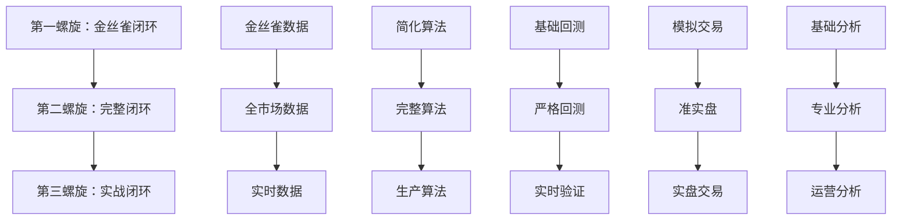

# EmotionQuant Reborn 螺旋闭环设计（Plan B）

**创建时间**: 2026-02-23  
**更新时间**: 2026-02-23  
**设计理念**: 真正的螺旋闭环，每个螺旋都是完整的端到端系统  
**状态**: Plan B 备选方案（与 Plan A 同精度）  

---

## 设计原则

1. **真螺旋**：每个螺旋都是完整的数据→算法→验证→交易→分析闭环
2. **可实战**：每个螺旋完成后都能产生可用的交易信号和回测结果
3. **渐进增强**：后续螺旋在前一螺旋基础上增强，而非重建
4. **成果可见**：每个螺旋都有明确的业务价值输出
5. **同精度门禁**：Plan B 与 Plan A 使用同一精度门禁（窗口、归因对比、双档校准、Pre-Live）

---

## 同精度约束（与 Plan A 对齐）

1. Canary 窗口最低 `2020-01-01` 到 `2024-12-31`（理想 `2019-01-01` 到 `2024-12-31`）。
2. 归因必须包含：`signal/execution/cost` 三分解 + `MSS vs 随机` + `MSS vs 技术基线`。
3. `S3c/S3d/S3e` 使用双档门禁：`MVP` 与 `FULL`。
4. `S3c/S3d/S3e` 准备可并行，收口与宣告必须串行。
5. 生产前必须通过 `螺旋3.5（Pre-Live）`：连续20交易日预演无 P0 事故。
6. 全部螺旋必须给出 `GO/NO_GO` 结论。

---

## 三大螺旋设计

### 第一螺旋：金丝雀闭环（2-3个月）
**目标**：建立最小可用的情绪量化系统

#### 数据层（本地优先）
- **金丝雀数据包**：精选50只活跃股票，最低5年历史数据（2020-2024）
- **本地数据库**：DuckDB，完整的OHLCV + 基本面数据
- **实时补采**：TuShare每日增量更新

#### 核心算法（最小可用版）
- **MSS简化版**：基于成交量和价格动量的情绪评分
- **IRS简化版**：基于行业轮动的配置建议（仅主要行业）
- **PAS简化版**：基于技术指标的个股评分
- **集成逻辑**：简单加权平均，固定权重

#### 验证与回测
- **历史回测**：基于金丝雀数据包的5年回测（最低2020-2024）
- **风险控制**：基本的止损和仓位控制
- **绩效评估**：收益率、最大回撤、夏普比率

#### 交易执行（模拟）
- **信号生成**：每日产生买卖信号
- **模拟交易**：纸上交易，记录执行结果
- **成本模拟**：包含手续费和滑点

#### 分析输出
- **日报**：每日信号和持仓报告
- **周报**：绩效分析和风险评估
- **GUI界面**：基本的信号展示和历史回测结果

**收口标准**：
- 金丝雀数据包完整入库
- 每日能产生5-10个交易信号
- 5年回测年化收益>10%，最大回撤<20%
- GUI能展示当日信号和历史绩效

### 第二螺旋：完整闭环（3-4个月）
**目标**：扩展到全市场，完善核心算法

#### 数据层（全市场）
- **完整历史数据**：A股全市场16年历史数据
- **多源数据**：TuShare + AKShare + Wind（备用）
- **数据质量**：完整的数据清洗和质量检查

#### 核心算法（完整版）
- **MSS完整版**：多因子情绪模型，自适应阈值
- **IRS完整版**：全行业覆盖，动态权重调整
- **PAS完整版**：多维度个股评分，风险调整
- **集成逻辑**：动态权重，基于历史表现调整

#### 验证与回测（严格版）
- **多周期回测**：1年、3年、5年多个时间窗口
- **压力测试**：熊市、震荡市场景测试
- **归因分析**：收益来源分解，风险因子分析

#### 交易执行（准实盘）
- **实盘模拟**：基于真实价格的高保真模拟
- **成本模型**：精确的交易成本和市场冲击模型
- **风险管理**：动态止损、仓位管理、流动性控制

#### 分析输出（专业版）
- **完整报告**：日报、周报、月报、季报
- **风险监控**：实时风险指标监控
- **归因分析**：详细的收益归因和风险分解
- **GUI增强**：专业级界面，支持策略调优

**收口标准**：
- 全市场数据完整入库（4000+股票，16年历史）
- 每日产生20-50个交易信号
- 多周期回测稳定盈利（年化>15%，回撤<20%）
- 完整的归因分析和风险报告

### 第三螺旋：实战闭环（2-3个月）
**目标**：迎接实盘交易，完善运维体系

#### 数据层（生产级）
- **实时数据流**：毫秒级行情数据接入
- **多源冗余**：多个数据源自动切换
- **监控告警**：数据质量实时监控

#### 核心算法（生产级）
- **算法优化**：基于第二螺旋的表现优化参数
- **自适应调整**：根据市场状态自动调整策略
- **风险增强**：极端市场情况的应对机制

#### 验证与回测（实时版）
- **滚动验证**：每日滚动验证策略有效性
- **实时监控**：策略表现实时监控和预警
- **自动调优**：基于最新数据自动调优参数

#### 交易执行（实盘就绪）
- **券商接口**：对接主流券商交易接口
- **订单管理**：智能订单拆分和执行
- **风险熔断**：实时风险监控和自动熔断

#### 分析输出（运营级）
- **运营监控**：系统健康度、策略表现监控
- **客户报告**：面向投资者的专业报告
- **合规报告**：满足监管要求的各类报告
- **API接口**：支持第三方系统集成

**收口标准**：
- 系统7×24小时稳定运行
- 实盘交易就绪（通过券商测试环境验证）
- 完整的运维监控体系
- 满足监管合规要求

### 第三点五螺旋：Pre-Live 预演闭环（1-2个月）
**目标**：在真实行情下完成零真实下单预演，验证稳定性和恢复能力。

**收口标准**：
- 连续 20 个交易日预演通过
- 预演期间 0 个 P0 事故
- 每日偏差分解复盘完整（signal/execution/cost）
- 至少 1 次故障恢复演练通过
- 预演评审 `GO/NO_GO` 明确

---

## 螺旋间的关系

---

## 与当前Plan A的对比（修订后）

| 维度 | Plan A（修订版） | Plan B（Reborn，同精度） |
|------|----------------|------------------|
| 设计理念 | 任务串行，模块化 | 螺旋闭环，端到端 |
| 成果可见性 | 模块完成，整体不可用 | 每个螺旋都可用 |
| 数据策略 | 模拟数据为主 | 本地数据库优先 |
| 算法实现 | 分模块实现 | 端到端实现 |
| 验证方式 | 业务闭环 + 工程实现双视图 | 业务闭环 + 工程实现双视图 |
| 风险控制 | 技术风险 | 业务风险+技术风险 |
| 交付节奏 | 长周期，大爆炸 | 短周期，渐进式 |

---

## 实施建议

### 如果选择Plan B
1. **暂停当前Plan A**：保留已有代码作为参考
2. **重新设计架构**：以螺旋闭环为核心重新设计
3. **优先数据层**：先建立本地数据库和金丝雀数据包
4. **快速迭代**：每个螺旋内部采用敏捷开发

### 如果继续Plan A
1. **强化数据落地**：立即实现TuShare到本地数据库的完整链路
2. **端到端验证**：每个模块完成后立即进行端到端测试
3. **业务价值导向**：每个阶段都要有可演示的业务价值
4. **螺旋化改造**：将现有线性流程改造为螺旋式

---

## 经验教训总结

1. **过度模块化**：将系统拆分得过细，失去了整体性
2. **缺乏数据基础**：没有优先建立本地数据库
3. **测试驱动偏差**：过分关注单元测试，忽视了业务价值验证
4. **线性思维**：用传统软件开发思维做量化系统
5. **成果不可见**：长时间看不到可用的系统

---

## 结论

Plan B提供了一个真正的螺旋闭环设计，每个螺旋都是完整的量化系统，能够产生实际的业务价值。这种设计更符合量化系统的特点，也更容易看到成果和进行调优。

无论选择哪个方案，关键是要确保：
1. **数据优先**：本地数据库是一切的基础
2. **端到端验证**：每个阶段都要有完整的业务流程
3. **成果可见**：定期产生可演示的业务价值
4. **螺旋迭代**：在完整系统基础上不断增强

---

## 配套文件（同精度）

- `Governance/SpiralRoadmap/planB/PLAN-B-EXECUTION-CHECKLIST.md`
- `Governance/SpiralRoadmap/planB/PLAN-B-READINESS-SCOREBOARD.md`
