# Plan B 依赖图（PB 主链 + Plan A 关联）

**创建时间**: 2026-02-25  
**状态**: Active  
**用途**: Plan B 微圈间依赖可视化与 Plan A 关联标注

---

## 1. PB 主链依赖

```mermaid
flowchart LR
  subgraph 螺旋1[螺旋1 Canary]
    PB11[PB-1.1 数据闭环] --> PB12[PB-1.2 算法闭环]
    PB12 --> PB13[PB-1.3 最小回测]
    PB13 --> PB14[PB-1.4 最小归因]
  end

  subgraph 螺旋2[螺旋2 Full]
    PB21[PB-2.1 采集扩窗] --> PB22[PB-2.2 完整回测归因]
    PB22 --> PB23[PB-2.3 行业校准]
    PB23 --> PB24[PB-2.4 MSS/Val校准]
    PB24 --> PB25[PB-2.5 极端防御]
  end

  subgraph 螺旋3[螺旋3 Production]
    PB31[PB-3.1 展示闭环] --> PB32[PB-3.2 稳定化]
    PB32 --> PB33[PB-3.3 调度闭环]
    PB33 --> PB34[PB-3.4 Pre-Live]
  end

  PB14 -->|螺旋1 GO| PB21
  PB25 -->|螺旋2 GO| PB31
```

---

## 2. Plan A 关联标注

| PB 微圈 | Plan A 对应 | 共享证据 |
|---|---|---|
| PB-1.1 | S0a/S0b/S0c | `raw_daily`、`market_snapshot`、`data_readiness_gate.md` |
| PB-1.2 | S1a/S1b/S2a/S2b/S2c | `mss_panorama`、`integrated_recommendation`、`validation_gate_report.md` |
| PB-1.3 | S3(min) | `backtest_results`、`backtest_trade_records`、`ab_metric_summary.md` |
| PB-1.4 | S3b(min) | `ab_benchmark_report.md`、`attribution_summary.json` |
| PB-2.1 | S3a/S3ar | `fetch_progress.json`、`throughput_benchmark.md` |
| PB-2.2 | S3/S4/S3b | `backtest_results`（多窗口）、`trade_records_sample`、`attribution_summary.json` |
| PB-2.3 | S3c | `industry_snapshot_sw31_sample`、`irs_allocation_coverage_report.md` |
| PB-2.4 | S3d/S3e | `mss_regime_thresholds_snapshot`、`validation_oos_calibration_report.md` |
| PB-2.5 | S4b | `extreme_defense_report.md`、`stress_trade_replay.csv` |
| PB-3.1 | S5 | `gui_snapshot.png`、`daily_report_sample.md` |
| PB-3.2 | S6 | `consistency_replay_report.md`、`debt_settlement_log.md` |
| PB-3.3 | S7a | `scheduler_status.json`、`scheduler_run_history.md` |
| PB-3.4 | 螺旋3.5 | `preview_deviation_summary.json`、`fault_recovery_drill_report.md` |

---

## 3. 数据层级依赖（与 Plan A 一致）

- L2 只读 L1
- L3 只读 L1/L2
- L4 只读 L1/L2/L3
- 禁止反向依赖

---

## 4. 阻断规则

1. 前置微圈未 PASS/WARN，后续微圈不得启动。
2. 螺旋间切换必须通过 GO/NO_GO 门禁。
3. `validation_weight_plan` 桥接链断裂时，PB-1.3 及后续微圈全部阻断。
4. `factor_gate_raw=FAIL` 比例 >50%（扩窗后）时，PB-2.5 阻断。

---

## 5. 变更记录

| 版本 | 日期 | 变更 |
|---|---|---|
| v1.0 | 2026-02-25 | 首版：PB 主链 mermaid 图 + Plan A 关联标注 + 数据层级依赖 + 阻断规则 |
